<!--
  Lumen: free SaaS / AI landing page template (HTML, GSAP, Lenis, Three.js). MIT licensed.
  Made by MiddleSugar7000, freelance full-stack developer: https://middlesugar7000.xyz
-->

<a href="https://middlesugar7000.github.io/lumen-saas-landing-page-template/">
  
</a>

<p align="center">
  <a href="https://middlesugar7000.github.io/lumen-saas-landing-page-template/"></a>&nbsp;
  <a href="https://github.com/MiddleSugar7000/lumen-saas-landing-page-template/generate"></a>&nbsp;
  <a href="https://github.com/MiddleSugar7000/lumen-saas-landing-page-template/archive/refs/heads/main.zip"></a>&nbsp;
  <a href="https://github.com/MiddleSugar7000/lumen-saas-landing-page-template/stargazers"></a>
</p>

<p align="center">
  
  
  
  
  <a href="https://middlesugar7000.xyz"></a>
</p>

# Lumen: Free SaaS Landing Page Template with Three.js (HTML + GSAP + Lenis)

**Lumen is a free, MIT-licensed landing page template for SaaS, AI and developer-tool products.** It's a dark, cinematic page for a fictional AI inference cloud, built around one persistent Three.js scene: a liquid chrome core with a glass ring that, as you scroll, dissolves into 11,000 particles that become a globe and then a GPU fabric. Around it: GSAP ScrollTrigger motion, Lenis smooth scroll, a bento grid of live mini UIs, a console mockup, pricing, FAQ and more. Plain HTML, CSS and JS: no framework, no npm, no build step.

Use it for an AI product, API, dev tool, cloud platform, B2B SaaS, startup launch or waitlist page. Swap the copy and you have a premium launch page in an afternoon.

> 🛠️ **Want one built for your own product?** This template was designed and coded by **[MiddleSugar7000](https://middlesugar7000.xyz)**, a freelance full-stack developer. Custom landing pages from **$450**, delivered in 48–72 hours. **[Hire me →](https://middlesugar7000.xyz/#contact)**

---

## Contents

- [Preview](#preview)
- [Features](#features)
- [Quick start](#quick-start)
- [Customize it](#customize-it)
- [Page sections](#page-sections)
- [Performance](#performance)
- [Tech stack](#tech-stack)
- [FAQ](#faq)
- [License](#license)
- [Need a custom landing page?](#need-a-custom-landing-page)

## Preview

<a href="https://middlesugar7000.github.io/lumen-saas-landing-page-template/">
  
</a>

## Features



- **One scroll-driven 3D scene.** A procedural Three.js world (no model files): liquid chrome core, fresnel glass ring, chrome orbits and a particle field that morphs halo → globe → GPU fabric in a pinned story section, then returns as a rising "sun" behind the final CTA.
- **Motion with weight.** Lenis smooth scroll, GSAP ScrollTrigger + SplitText: word-by-word hero reveal, scroll-fill statement text, a console mockup that tilts into place, stacking cards, rolling counters, parallax.
- **Live mini UIs.** Latency sparkline that updates in real time, model router with travelling packets, a typing terminal, autoscaling bars, flipping toggles, uptime ring, spend meter. All HTML/SVG, no images.
- **13 sections.** Hero, logos, statement, 3D story, bento features, console, stats, how-it-works, testimonials, pricing with monthly/yearly toggle, FAQ, CTA, footer.
- **Fast on big screens.** A render-pixel budget and automatic quality scaling keep it smooth on 1440p/4K monitors and laptops (see [Performance](#performance)).
- **Ember Dark design system.** Near-black blue-tinted surfaces, one ember accent (`#FF6A2B`), Geist + Instrument Serif typography, hairline borders.
- **Responsive and accessible.** Fluid `clamp()` type, mobile layouts, keyboard focus states, and full `prefers-reduced-motion` support.
- **SEO-ready.** Semantic headings, meta description, Open Graph tags and theme color.

## Quick start

```bash
git clone https://github.com/MiddleSugar7000/lumen-saas-landing-page-template.git
cd lumen-saas-landing-page-template
npx serve .
```

Serve the folder rather than double-clicking `index.html`: the Three.js scene is an ES module loaded through an import map, which browsers block on `file://`. Any static server works (`python -m http.server` too).

**Deploy for free:** push to GitHub and enable **GitHub Pages**, or drag the folder into Netlify, Vercel or Cloudflare Pages.

## Customize it

| What | Where |
| --- | --- |
| Colors, radii, easing | CSS variables on `:root` in `css/style.css` (`--bg-0`, `--accent`, `--r-lg`…) |
| Accent color | Change `--accent` / `--accent-2` in CSS and `ACCENT` at the top of `js/scene.js` |
| Fonts | The Google Fonts `<link>` in `<head>` (Geist, Geist Mono, Instrument Serif) |
| Copy, pricing, FAQ | Plain HTML in `index.html` |
| 3D scene, choreography | `js/scene.js` (materials, particle shapes, scroll poses in `frame()`) |
| Motion, mini UIs | `js/main.js` (ScrollTriggers, counters, charts, testimonials data) |
| Template credit badge | The `<aside class="promo">` block in `index.html`. Delete it to remove the badge |

## Page sections

1. **Hero** with the liquid chrome core, word-by-word headline and live telemetry strip
2. **Logo marquee** with masked edges
3. **Statement** that fills in as you scroll
4. **Pinned 3D story** with three stages: bring any model, run it everywhere (globe), scale on the fabric
5. **Bento features** with seven live mini UIs
6. **Console mockup** that tilts into place, with floating notifications
7. **Stats** with rolling counters over a giant faded number
8. **How it works** as stacking cards (terminal, region map, request trace)
9. **Testimonials** in three vertical marquee columns
10. **Pricing** with an animated monthly / yearly toggle
11. **FAQ** accordion
12. **Final CTA** with the core rising behind the headline
13. **Footer** with a giant wordmark

## Performance

The 3D scene renders at most ~2.1M pixels per frame (≈1080p), whatever the display. On a 1440p monitor with Windows scaling, the native resolution would be 6–8M pixels. Bloom runs at half resolution, the glass ring uses a cheap fresnel shader instead of a transmission pass, and the scene pauses whenever no 3D section is on screen. If frames still run long, resolution drops step by step and then bloom switches off. Under `prefers-reduced-motion` the camera stays calm and every scroll animation is disabled.

## Tech stack

HTML5 · CSS (custom properties) · JavaScript (ES modules) · [Three.js](https://threejs.org) r170 · [GSAP 3.13](https://gsap.com) + ScrollTrigger + SplitText · [Lenis](https://lenis.darkroom.engineering) · Google Fonts. Everything is loaded from CDNs.

## FAQ

**Is this SaaS landing page template really free?**
Yes. Lumen is released under the MIT license, so you can use it in personal and commercial projects, modify it and ship it. Keeping the license notice is the only requirement.

**Do I need React, Next.js or a build tool?**
No. It's plain HTML/CSS/JS. Serve the folder from any static host.

**What kind of product is it good for?**
AI products, APIs, developer tools, cloud and infrastructure platforms, B2B SaaS, startup launches and waitlists. Anything that benefits from a dark, technical, premium look.

**Can I remove the "Free template by MiddleSugar7000" badge?**
Yes. Delete the `<aside class="promo">` block in `index.html`. A link back is appreciated, never required.

**Will the 3D scene slow down my visitors' devices?**
It's built to scale down. It caps render resolution, pauses when off screen, and lowers quality automatically on slower GPUs.

**Who made this template?**
[MiddleSugar7000](https://middlesugar7000.xyz), a freelance full-stack developer who builds custom landing pages, SaaS products, APIs and AI integrations.

**Can you build a custom version for my business?**
Yes. Custom landing pages start at $450 and are typically delivered in 48–72 hours, with a fixed quote within 24 hours and no calls required. [Get in touch](https://middlesugar7000.xyz/#contact).

## License

[MIT](LICENSE) © MiddleSugar7000. A ⭐ or a link back to [middlesugar7000.xyz](https://middlesugar7000.xyz) is appreciated, never required.

Lumen is a fictional company; names, logos, quotes and numbers on the page are placeholder content. Portrait photos load from [Unsplash](https://unsplash.com) and should be replaced with your own.

## Need a custom landing page?

<a href="https://middlesugar7000.xyz/#contact">
  
</a>

<p align="center">
  <a href="https://middlesugar7000.xyz/#contact"></a>&nbsp;
  <a href="https://middlesugar7000.xyz"></a>
</p>

I'm **MiddleSugar7000**, a freelance full-stack developer. I design and build:

- **Custom landing pages:** from $450, 48–72 hours
- **Web apps and SaaS MVPs:** auth, PostgreSQL, Stripe / Dodo Payments / Whop checkout, from $950
- **APIs and AI integrations:** OpenAI, Anthropic Claude, Gemini, from $650

Text-only communication (Discord, Telegram, email or X), fixed quotes, weekly previews, and you own 100% of the code.

🌐 [middlesugar7000.xyz](https://middlesugar7000.xyz) · ✈️ [Telegram](https://t.me/middlesugar7000) · 💬 Discord: `middlesugar7000.main` · 📧 [middlesugar700@gmail.com](mailto:middlesugar700@gmail.com)

More free templates: [VOLT Arc](https://github.com/MiddleSugar7000/volt-arc-landing-page-template), a cinematic product launch page.

<p align="center"><sub>Keywords: free SaaS landing page template, AI landing page template, dark landing page template, Three.js landing page, WebGL landing page, GSAP ScrollTrigger template, Lenis smooth scroll, startup landing page, developer tool website template, HTML landing page, MIT website template.</sub></p>
